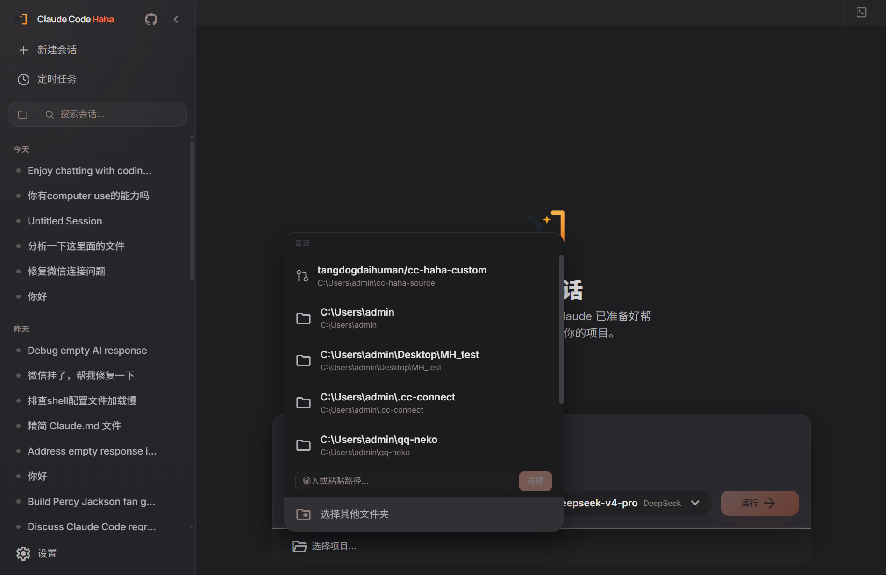

# Claude Code Haha（个人定制版）

> 基于 [NanmiCoder/cc-haha](https://github.com/NanmiCoder/cc-haha) 的个人定制分支，加了 Python 桌面壳、DeepSeek 视觉配置、IM 连接等自定义功能。随时按需修改，无需等上游更新。

<p align="center">
  
</p>

<div align="center">

[](https://github.com/tangdogdaihuman/cc-haha-custom/blob/main/LICENSE)

</div>

本仓库是 [cc-haha](https://github.com/NanmiCoder/cc-haha) 的个人定制版，原作者 [程序员阿江-Relakkes](https://github.com/NanmiCoder)。

## 桌面端预览

<table>
  <tr>
    <td align="center" width="50%"><br><b>主界面</b><br>会话列表 + AI 对话 + 项目选择 + 思考强度</td>
    <td align="center" width="50%"><br><b>右侧终端面板</b><br>PowerShell 实时终端，与聊天同屏操作</td>
  </tr>
  <tr>
    <td align="center" width="50%"><br><b>DeepSeek 视觉系统</b><br>阿里云 DashScope 三级模型 + 本地 Tesseract OCR</td>
    <td align="center" width="50%"><br><b>IM 接入（cc-connect 方案）</b><br>飞书 / 微信 / Telegram 统一配置</td>
  </tr>
  <tr>
    <td align="center" width="50%"><br><b>Computer Use</b><br>Python 环境检测 + 授权应用配置</td>
    <td align="center" width="50%"><br><b>定时任务</b><br>按计划自动运行，任意会话输入 /schedule 创建</td>
  </tr>
  <tr>
    <td align="center" width="50%"><br><b>项目选择</b><br>本地文件夹浏览 + GitHub 项目导入 + 模型切换</td>
    <td align="center"></td>
  </tr>
</table>

## 运行方式

本定制版使用 Python pywebview 作为桌面壳，无需编译。

```bash
git clone https://github.com/tangdogdaihuman/cc-haha-custom.git
cd cc-haha-custom/desktop
bun install
cd desktop-shell && python main.py
```

首次使用需要在设置里配置 API Key 和模型。

## 定制功能

- **Python 桌面壳**：pywebview 替代 Tauri，`python main.py` 直接启动，零编译
- **DeepSeek 视觉系统**：阿里云 DashScope Qwen-VL-Plus / Qwen-VL-Flash / Qwen-OCR 三级备选 + 本地 Tesseract OCR 兜底
- **IM 接入管理**：cc-connect 飞书 / 微信 / Telegram 统一配置面板，支持在线编辑
- **思考强度选择**：输入框独立胶囊按钮，max / xhigh / high / medium / low 五档，默认 max
- **右侧终端面板**：PowerShell 实时终端嵌入右侧面板，与聊天同屏
- **Computer Use**：Python 环境检测 + 截图 + 键鼠操控桌面应用
- **实时 Token 显示**：思考/运行期间实时显示 ↑输入 ↓输出 总token 消耗量
- **定时任务**：桌面端创建计划任务，自动运行
- **项目选择**：本地文件夹浏览 + GitHub 项目导入 + 模型切换

## 技术栈

| 类别 | 技术 |
|------|------|
| 语言 | TypeScript |
| 桌面壳 | Python pywebview |
| 桌面 UI | React + Vite |
| 后端 | Bun + Node.js |
| API | Anthropic SDK（兼容 DeepSeek / 阿里云等） |

## 致谢

- 原作者 [NanmiCoder/cc-haha](https://github.com/NanmiCoder/cc-haha)
- [React](https://github.com/facebook/react) · [Tauri](https://github.com/tauri-apps/tauri) · [cc-switch](https://github.com/farion1231/cc-switch)

## Disclaimer

本仓库基于 2026-03-31 从 Anthropic npm registry 泄露的 Claude Code 源码。所有原始源码版权归 [Anthropic](https://www.anthropic.com) 所有。仅供学习和研究用途。
