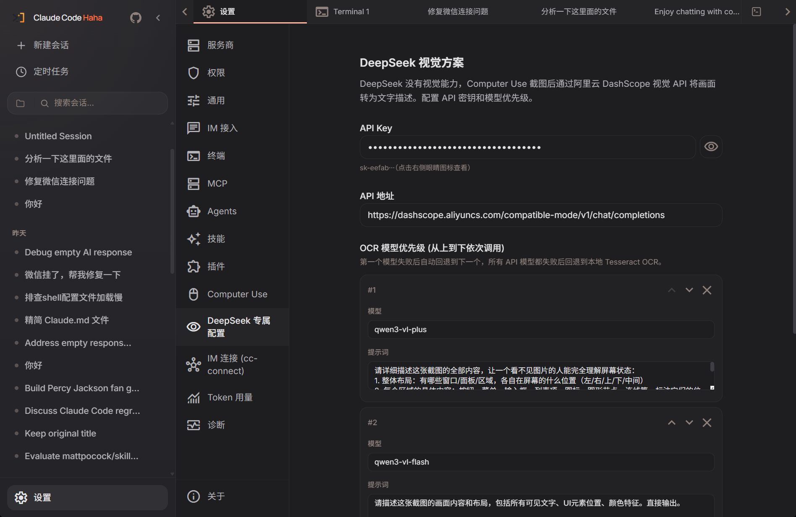

# Claude Code Haha（个人定制版）

> 基于 [NanmiCoder/cc-haha](https://github.com/NanmiCoder/cc-haha) 的个人定制分支。Python 桌面壳、DeepSeek 视觉、IM 接入、Computer Use 开箱即用。

<p align="center">
  
</p>

<div align="center">

[](LICENSE)
[](https://github.com/NanmiCoder/cc-haha)

</div>

本仓库是 [cc-haha](https://github.com/NanmiCoder/cc-haha) 的个人定制版，原作者 [程序员阿江-Relakkes](https://github.com/NanmiCoder)。

## 预览

<table>
  <tr>
    <td align="center" width="50%"><br><b>主界面</b></td>
    <td align="center" width="50%"><br><b>右侧终端面板</b></td>
  </tr>
  <tr>
    <td align="center" width="50%"><br><b>DeepSeek 视觉系统</b></td>
    <td align="center" width="50%"><br><b>IM 接入（cc-connect）</b></td>
  </tr>
  <tr>
    <td align="center" width="50%"><br><b>Computer Use</b></td>
    <td align="center" width="50%"><br><b>定时任务</b></td>
  </tr>
</table>

## 运行

```bash
git clone https://github.com/tangdogdaihuman/cc-haha-custom.git
cd cc-haha-custom/desktop
bun install
cd desktop-shell && python main.py
```

需要 Python 3.11+、Bun、Tesseract OCR。首次运行在设置里配置 API Key 和模型。

## 定制功能

- **Python 桌面壳**：pywebview 替代 Tauri，零编译
- **DeepSeek 视觉**：阿里云 DashScope Qwen-VL 三级 + Tesseract OCR
- **IM 接入**：飞书 / 微信 / Telegram 统一配置
- **思考强度**：max / xhigh / high / medium / low 五档
- **终端面板**：PowerShell 嵌入右侧
- **Computer Use**：截图 + 键鼠操控
- **实时 Token**：思考/运行期间显示 token 消耗

## 致谢

- 原作者 [NanmiCoder/cc-haha](https://github.com/NanmiCoder/cc-haha)
- [React](https://github.com/facebook/react) · [Tauri](https://github.com/tauri-apps/tauri)

## Disclaimer

本仓库基于 2026-03-31 从 Anthropic npm registry 泄露的 Claude Code 源码。所有原始源码版权归 [Anthropic](https://www.anthropic.com) 所有。仅供学习和研究用途。
